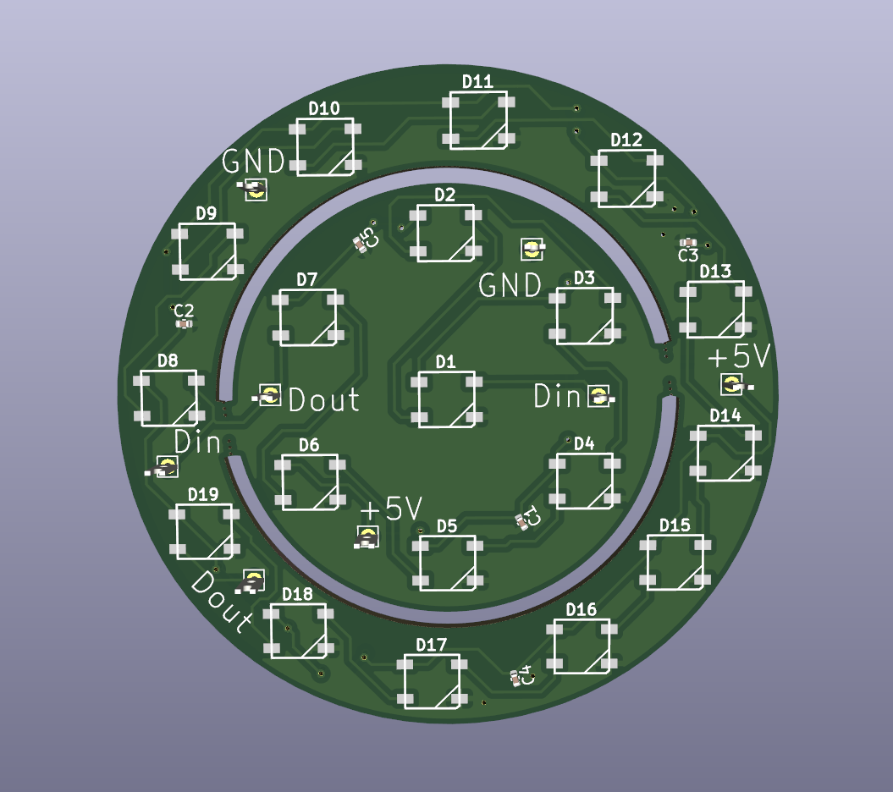
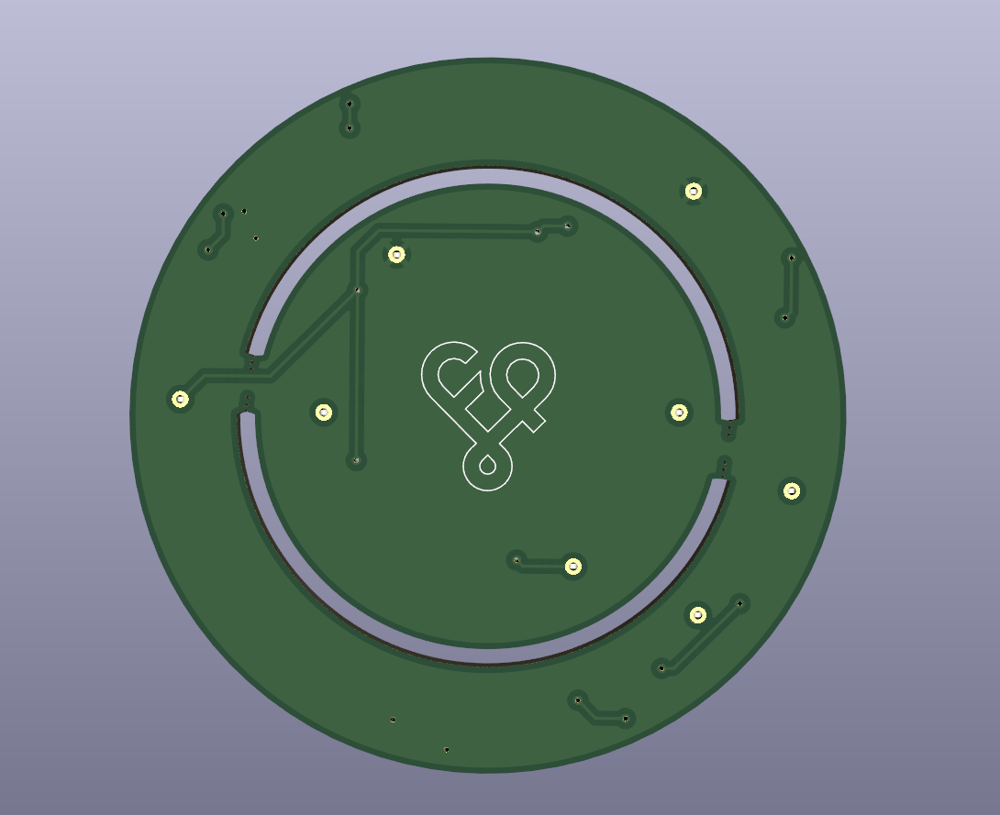

# fingerpunch neopixel ring

Two rings, seprated by breakaway tabs (mouse bites)

You can use it as one large ring, or break them apart for two smaller rings

## fabrication

This is set up to use at JLCPCB. You can fab with PCBA.

All the necessary files are in the pcb/production directory in this repository.

## images

